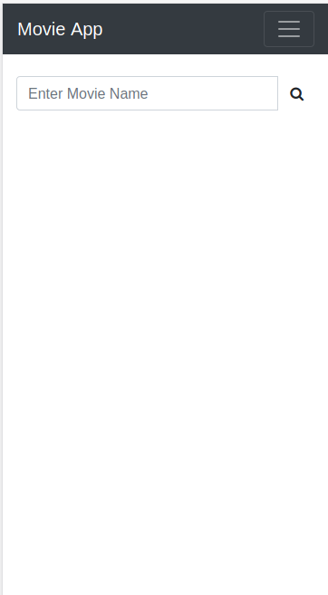
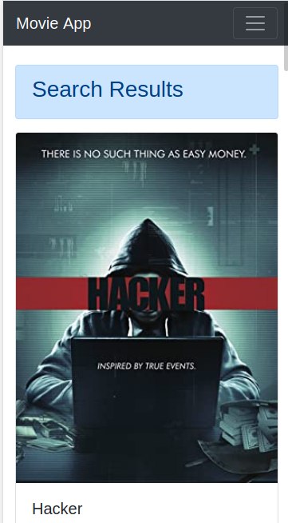
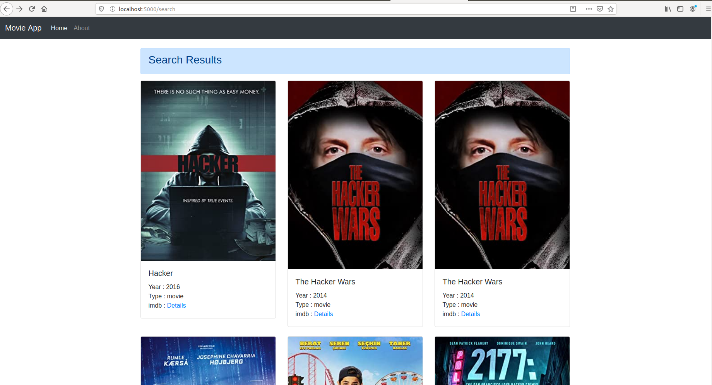

# Movie App
> Simple Web app that search and give information of movie.







## Installation

OS X & Linux:

```sh

sudo apt install git 
sudo apt install python3
sudo apt get python3-pip
pip3 install pipenv
git clone https://github.com/Aju100/Flask-Movie-App.git
cd Flask-Movie-App
pipenv install
python3 app.py
```

Windows:
You can download git and python3 and install pip as well as pipenv package.
```sh
git clone https://github.com/Aju100/Flask-Movie-App.git
cd Flask-Movie-App
pipenv install
python app.py
```

## Bult with

* [Flask]() - Microframework
* OMDBapi - Api for Movie
* HTML - Markup Language
* CSS & Bootstrap -  UI & Styling
* Js & Jquery - More interactive & functionality

## Release History

* 0.0.2
	* Fixes the about pages
	* Added Favourites features
	* Integrate with database

* 0.0.1
	* Work in progress

## Meta

Aju Tamang - ajutamang10@outlook.com

## Contributing

1. Fork it (<https://github.com/Aju100/Flask-Movie-App.git>)
2. Create your feature branch (`git checkout -b feature/fooBar`)
3. Commit your changes (`git commit -am 'Add some fooBar'`)
4. Push to the branch (`git push origin feature/fooBar`)
5. Create a new Pull Request

## License

This project is licensed under the MIT License - see the [LICENSE.md](LICENSE.md) file for details